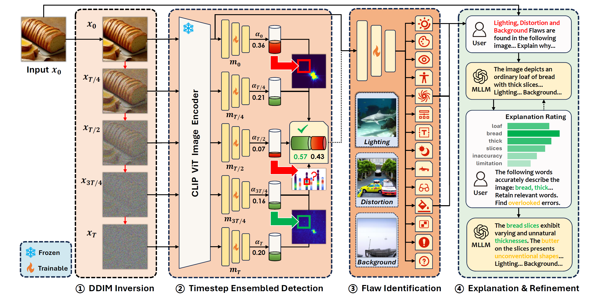

# ESIDE: Explainable Synthetic Image Detection through Diffusion Timestep Ensembling

## Introduction

This is the implementation of the paper: 

<a href="https://arxiv.org/abs/2503.06201">Explainable Synthetic Image Detection through Diffusion Timestep Ensembling</a>  [AAAI-26]

Our code and datasets will be released in November, 2025!



## Installation

```bash


```

## Datasets

### GenHard

Synthetic and natural images of greater detection difficulty. Across the 8 subsets of the GenImage benchmark, the 108,704 synthetic images and 112,682 natural images misclassified by a simple baseline classifier were identified as the harder samples and appended.

Download Link:

### GenExplain

A dataset comprising 54,210 groups of images, flaws (14 categories) and corresponding explanations. The ratings of relevant phrases across 3 refinement iterations are also included.

Download Link:


## Reproducibility

### Pipeline Demo


### Evaluation

#### Noised Images Generation

#### Synthetic Image Detection

#### Explanation Generation & Refinement


## Citation
