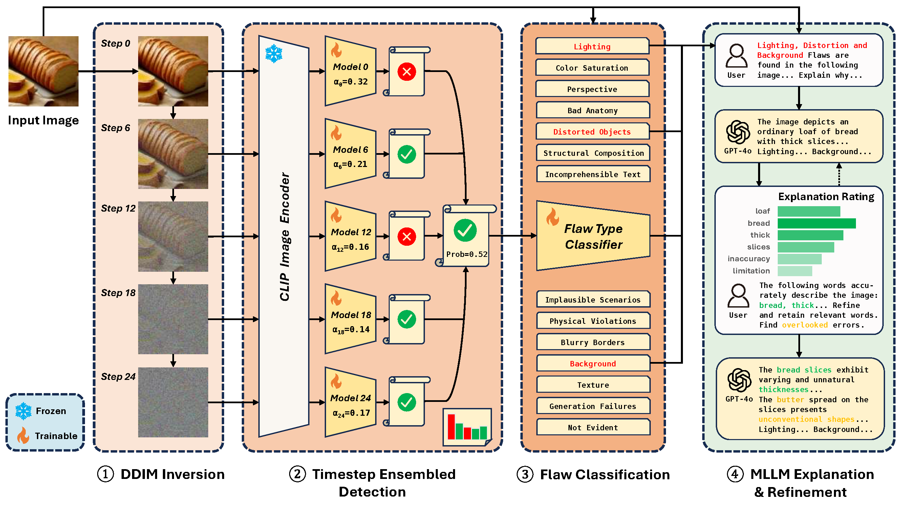

# ESIDE: Explainable Synthetic Image Detection through Diffusion Timestep Ensembling

## Introduction

This is the implementation of the paper: 

**[AAAI-26] <a href="https://arxiv.org/abs/2503.06201">Explainable Synthetic Image Detection through Diffusion Timestep Ensembling</a>**



Given an input image of unknown authenticity, DDIM Inversion is first applied to generate noised images 
corresponding to each diffusion timestep, which are subsequently passed through a CLIP image encoder 
for feature extraction, and then trained on an AdaBoost ensemble for Synthetic Image Detection. 


### Timeline
**[Coming Soon] 📅** Pipeline demos will be uploaded soon.

**[2026.02.20] 📝** Installation and reproducibility tutorials are now online!

**[2025.12.31] 🚀** Our main code and datasets have been released.

**[2025.11.08] 🎉** Our paper has been accepted by AAAI-26!

[//]: # (🚀🛠️📢📅  📦📝📊  🎉🌟🏆)

## Conda Installation

```bash
# 1. Clone Repository
git clone https://github.com/Shadowlized/ESIDE.git
cd ESIDE

# 2. Create and activate Conda environment
conda create -n ESIDE python=3.9.20 -y
conda activate ESIDE

# 3. Install dependencies
pip install -r requirements.txt

# 4. Optional: Verify the installation
python -c "import torch; print(f'Python Version: {torch.__sys__.version}'); print(f'CUDA Available: {torch.cuda.is_available()}')"
```

## Datasets

### GenHard

Synthetic and natural images of greater detection difficulty. Across the 8 subsets of the GenImage benchmark, the 108,704 synthetic images and 112,682 natural images misclassified by a simple baseline classifier were identified as the harder samples and appended.

We include only the filenames of the images in this dataset, while the original images need to be downloaded from <a href="https://github.com/GenImage-Dataset/GenImage">GenImage</a>. 

Download Link: <a href="https://huggingface.co/datasets/Shadowlized/GenHard">https://huggingface.co/datasets/Shadowlized/GenHard</a>

### GenExplain

A dataset comprising 54,210 groups of images, flaws (14 categories) and corresponding explanations. The ratings of relevant phrases across 3 refinement iterations are also included.

Download Link: <a href="https://huggingface.co/datasets/Shadowlized/GenExplain">https://huggingface.co/datasets/Shadowlized/GenExplain</a>


## Reproducibility Tutorials

The current section is for experimental reproducibility, functioning upon entire directories and datasets 
(GenImage, GenHard, GenExplain). These datasets need to be downloaded in advance, and their root directories 
need to be setup in `dataset.py` as below:

```python
dataset_root = "/your_home_dir/GenImage"
genexplain_dataset_root = "/your_home_dir/GenExplain"   # Optional for detection
```


### 1. DDIM Inversion Noised Images Generation

Download the diffusion models `256x256_diffusion_uncond.pt` and/or `512x512_diffusion.pt` from <a href="https://github.com/openai/guided-diffusion">guided-diffusion</a>, and place them under `/DIRE/guided_diffusion/models/`

Run `generation/gen_noised_imgs.py`, using the diffusion model corresponding to the resolution of the dataset chosen. 
For images larger than 512x512, we just use the `512x512_diffusion.pt` model. Setup the following args:

- `dataset_name`: Select a generator directory as input from the 8 generators "Midjourney", "SDV1.4", "SDV1.5", "ADM", "GLIDE", "VQDM", "Wukong", "BigGAN".
- `image_size`: Diffusion model to use, `256` or `512`.
- `batch_size`: Setup according to actual cuda memory size. For reference, `32` for 256x256 and `16` for 512x512.

### 2. AdaBoost Ensembled Synthetic Image Detection

Run `ensemble/ada_boost.py` based on the noised images generated in the previous step. 
Below are arguments and hyperparameters settings. 
When using GenHard to evaluate, remember to retrieve the original images based on the files recording the image names first.

- `DATASET_NAME`: Select a generator from the 8 generators listed in `DATASETS`.
- `dataset_root_dir`: Noised images directory (`.../stepwise-noised`)
- `dataset_hard_root_dir`: (Optional) GenHard noised hard images directory for evaluation, defaults to `None`.
- `save_dir`: Output directory for model checkpoints.
- `network_type`: Classifier architecture, defaults to `"L"`.
- `step_size`: Timestep ensemble stride (ensembling by what timestep interval, determines how many models in ensemble), defaults to `3` (e.g: A total of 9 models, corresponding to Step 0, 3, 6, ..., 24).
- `epochs`: Defaults to `50`, while Midjourney would need `100`.
- `mode`: Run `train` mode or `test` mode.
- `ckpt_fn`: Load a specific checkpoint (based on filename) under `save_dir`, defaults to an empty string.

Other rarely used arguments:

- `run_degradation`: For ablation studies experiments, defaults to `False`. Set it to `True` for testing the effect of training an ensemble on unnoised images only.
- `continue_pretrain_model_idx`: Continue training from the `idx`th model saved, if the previous training session was interrupted, defaults to `-1` if training from scratch.

### 3. Flaw Identification

- First, run `explanation/flaw_split_ds.py`, partitioning the GenExplain dataset into training and validation splits.
- Then, run `explanation/flaw_train_classifier.py`, training a flaw classifier based on images from each generation model. Devices and hyperparameter settings could be adjusted. 

### 4. Explanation Generation & Refinement

- First, run `explanation/explanation_flaw_gen.py` to generate an initial response based on the flaws classified.
- Then, run `explanation/iterate_refinement.py` to perform text-image similarity grounded iterative explanation refinement.

### Full Pipeline Demo (Coming Soon)


## Citation

AAAI-26 Version Coming Soon

```
@article{wu2025explainable,
  title={Explainable synthetic image detection through diffusion timestep ensembling},
  author={Wu, Yixin and Zhang, Feiran and Shi, Tianyuan and Yin, Ruicheng and Wang, Zhenghua and Gan, Zhenliang and Wang, Xiaohua and Lv, Changze and Zheng, Xiaoqing and Huang, Xuanjing},
  journal={arXiv preprint arXiv:2503.06201},
  year={2025}
}
```